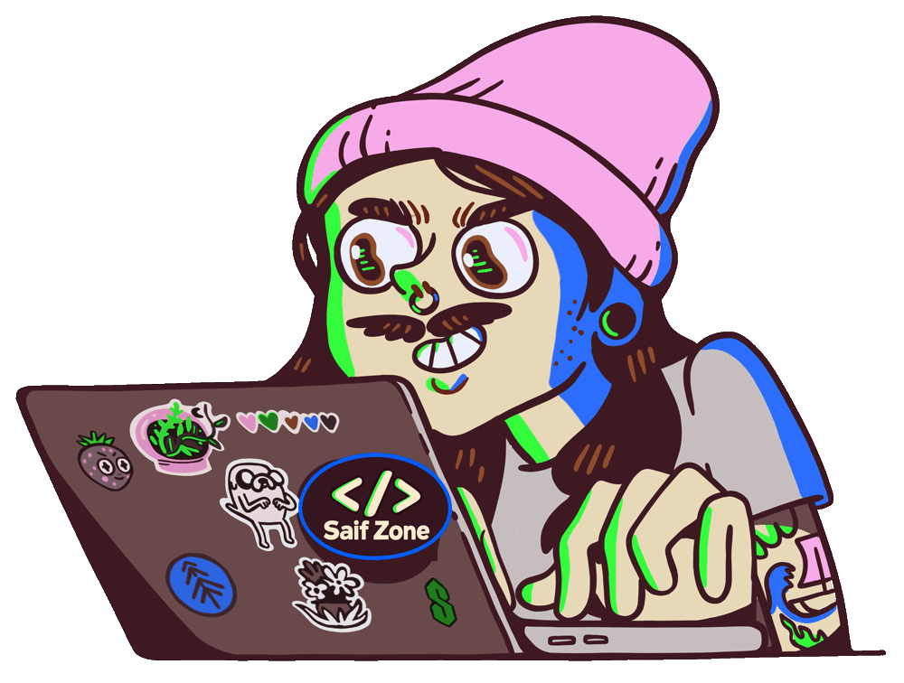

# 👋 Greetings, I’m Saif!

**Full-Stack Software Engineer | UI/UX Designer | Founder of NetTruly & LoveLit**

*Code-driven. Web-focused. Future-ready.*

 

---

## 💡 Design Meets Development

I’m **Rafiqul Islam Saif**, a designer and developer passionate about crafting meaningful digital experiences.

My focus areas include **full-stack web development**, **mobile app design**, and **user-centric UI/UX**. I bring development and design together to turn ideas into useful, intuitive products.

## 🚀 Currently Building — NetTruly

**Founder & Software Engineer · In development**

NetTruly is a social media platform designed to empower people to **speak freely and live truly**.

My work brings together:

- **Development:** Translate product ideas into functional features through full-stack web development.
- **Design:** Create user-centered interfaces and user flows with a focus on clarity, consistency, and usability.
- **Refinement:** Improve the platform’s features and overall user experience throughout development.

## 🛠️ Skills & Tools

| Focus | Technologies & Tools |
| :--- | :--- |
| **Programming Languages** | JavaScript · Python · Java · Swift · Go · C# |
| **Web Foundations** | HTML5 · CSS3 |
| **Web Development** | React · Node.js |
| **Data & Databases** | SQL · MySQL |
| **Version Control & Collaboration** | Git · GitHub |
| **Cloud Platforms** | AWS · Google Cloud |
| **Design & Prototyping** | Adobe XD · Photoshop · Illustrator · Canva |
| **CMS & Commerce** | WordPress · Shopify · Ghost · Blogger |

## 🎁 Beyond Development — LoveLit

**Founder & Creative Director**

I’m also the founder of **LoveLit**, a curated gift shop offering carefully selected products for thoughtful gifting and personal enjoyment.

I focus on its **brand identity**, **product presentation**, and **customer experience**, with quality and care guiding the business.

> *Lit with love—because love is the brightest light we can share!*

---

## 🤝 Let’s Build Together

I enjoy collaborating on creative projects, learning from different perspectives, and developing my skills through hands-on work.

**Interested in joining my team or collaborating on a project?**  
Feel free to reach out—I’d be happy to help!

| Channel | Find Me |
| :--- | :--- |
| 📧 **Email** | [rafiqulsaif@yahoo.com](mailto:rafiqulsaif@yahoo.com) |
| 💼 **LinkedIn** | [Rafiqul Islam Saif](https://www.linkedin.com/in/rafiqulsaif) |
| 💬 **Telegram** | [@rafiqulsaif](https://t.me/rafiqulsaif) |
| 💻 **GitHub** | [@rafiqulsaif](https://github.com/rafiqulsaif) |

 

**⚡ I turn “what ifs” into “it’s live.”**

[Explore My Repositories →](https://github.com/rafiqulsaif?tab=repositories)

**Let’s build something impactful together.**

